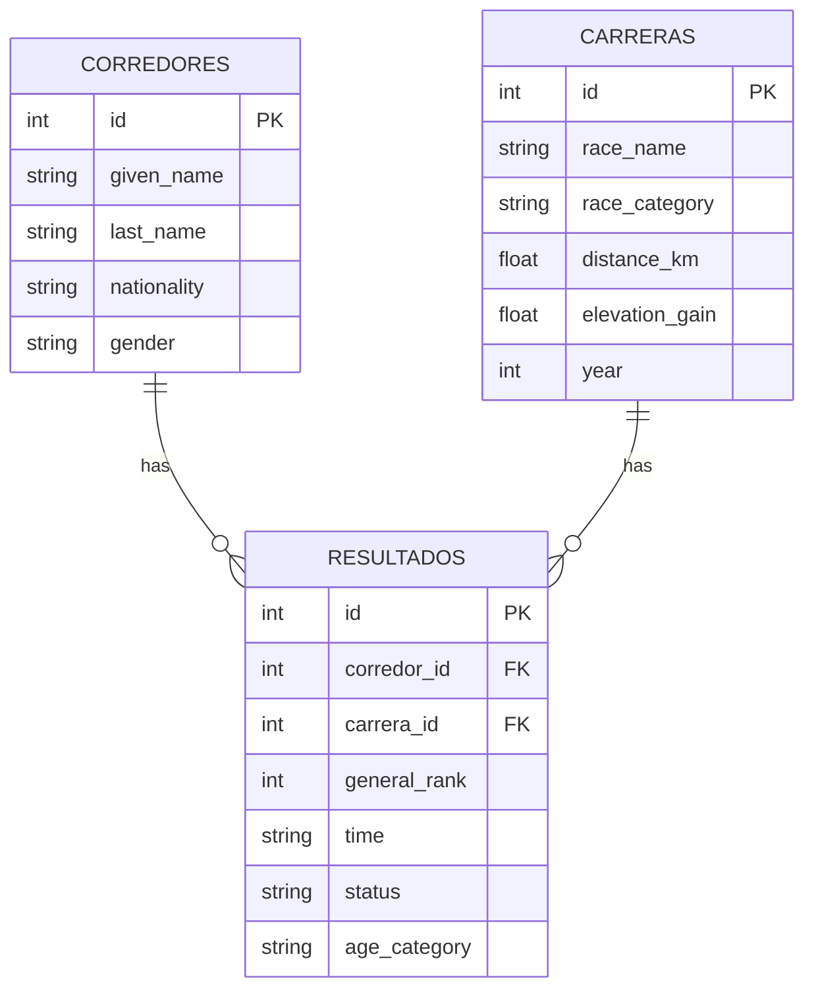

<h1>Database Normalizer - UTMB Puerto Vallarta 2024</h1>

<h2>Description</h2>

This script transforms a flat CSV file with UTMB Puerto Vallarta 2024 race results into a normalized SQLite database with three related tables: corredores, carreras, and resultados.
The main goal is to separate runner information, race information, and race results instead of keeping all the data in one large table. Each row in the source CSV represents a different runner record. Therefore, two or more runners can have the same name, last name, and nationality without being treated as the same person.

<h2>Languages Used</h2>

- <b> Python </b>

<h2>Technologies Used</h2>

- <b>Python 3.14 </b>

- <b>SQLite </b>

- <b>pandas 3.0.5</b>

<h2>Environment Used</h2>

- <b>Windows laptop</b>

<h2>Requirements</h2>

The script uses Python's built-in sqlite3 module and the pandas library.

Install pandas with:

pip install pandas

<h2>Script walk-through:</h2>

- <b>Input CSV</b>

The script reads a CSV file containing the flat UTMB results dataset. The expected columns are:

general_rank\
time\
given_name\
last_name\
nationality\
gender\
age_category\
status\
race_category\
race_name\
distance_km\
elevation_gain\
year

The input file path is defined in the CSV_PATH variable. The output database file is defined in DB_PATH.

CSV_PATH = r"C:\path\to\utmb_puerto_vallarta_24.csv"

DB_PATH = "utmb.db"

 

- <b>Cleaning the data</b>

Before creating the database, the script normalizes the column names by removing extra spaces, converting them to lowercase, and replacing spaces with underscores.

It also checks that all required columns are present. Text fields are cleaned by removing extra spaces and replacing missing values with empty strings.

Anonymous runners are also handled separately. When a runner has no last name, the script gives the record a temporary unique value so that different anonymous records are not merged.

 

- <b>Creating the database schema</b>

The script creates a SQLite database with three normalized tables:

<table>
  <thead>
    <tr>
      <th>Table</th>
      <th>Purpose</th>
    </tr>
  </thead>
  <tbody>
    <tr>
      <td>corredores</td>
      <td>Stores runner information</td>
    </tr>
    <tr>
      <td>carreras</td>
      <td>Stores race information0</td>
    </tr>
    <tr>
      <td>resultados</td>
      <td>Connects each runner with a race and stores the result</td>
    </tr>
  </tbody>
</table>

The Primary and Foreign keys are: 

corredores → corredor_ir (PK)\
carreras → carrera_id (PK)\
resultados → resultado_id (PK), corredor_ir (FK) and carrera_id (FK)

 

- <b>The corredores table</b>

This table stores:

id\
given_name\
last_name\
nationality\
gender

Each input row creates one new corredor_id.

The table does <b>not</b> use a UNIQUE constraint based on the runner's name, last name, or nationality. This is intentional because different people can have the same personal information.

For example:

| id   | given_name | last_name     | nationality                |
|------|----------|-----------------|----------------------------|
| 25   | Juan     | Perez           | Mexico                       |
| 87   | Juan     | Perez           | Mexico                       |

These are stored as two different runner records.

 

- <b>The carreras table</b>

This table stores:

id
race_name
race_category
distance_km
elevation_gain
year

A unique constraint is used with race_name, race_category, and year. This prevents the same race from being inserted more than once while still allowing different distances or race categories in the same event.

 

- <b>The resultados table</b>

This table stores the result of each runner in a race:

id
corredor_id
carrera_id
general_rank
time
status
age_category

Instead of identifying a runner by name, the script keeps the corredor_id created when that CSV row is inserted.

This preserves the exact relationship between the original CSV row and the corresponding database record.

 

- <b>Keeping duplicate names as different people</b>

One important part of the script is that it does not remove duplicate runner records.

The original flat file can contain runners with the same:

given_name
last_name
nationality

These records are still inserted separately because the source data represents them as different people.

This avoids losing records during normalization.

 

- <b>Data validation</b>

After inserting the data, the script checks the number of rows in corredores and resultados.

The number of rows in both tables must be the same as the number of rows in the original CSV.

For example, if the input file contains 1,000 records, the script expects:

CSV rows:       1,000
Corredores:     1,000
Resultados:     1,000

If the numbers do not match, the script raises an error instead of silently creating an incomplete database.

 

- <b>Output</b>

The script creates a SQLite database named:

utmb.db

This database contains the three normalized tables:

corredores
carreras
resultados

The script also prints a summary when the process finishes successfully:

Filas del CSV:      1426\
Corredores:         1426\
Resultados:         1426\
Base de datos creada en: utmb.db

 

<h2>How to Run</h2>
<ol>
  <li>Make sure Python 3.14 is installed.</li>
  <li>Install pandas:</li>
  pip install pandas
  <li>Set the correct path to the CSV file in CSV_PATH.</li>
  <li>Run the script:  </li>
  python build_utmb_db_fixed.py
  <li>The SQLite database utmb.db will be created in the same directory where the script is executed. </li>
</ol>

<h2>Database Structure</h2>

The final database follows a simple normalized structure:

<h2>Purpose</h2>

This project was created as a database and Python practice project using real-world race results. It demonstrates CSV data cleaning, database normalization, primary and foreign keys, SQLite, and data validation.

 

Data originally obtained from public UTMB results for educational and portfolio purposes.
